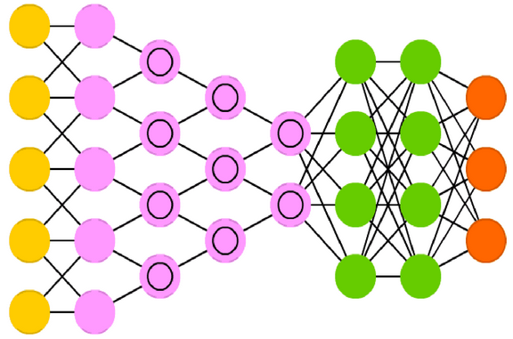

# Project Name
> Neural Networks with Keras and Tensorflow 

## Table of contents
* [General info](#general-info)
* [Screenshots](#screenshots)
* [Technologies](#technologies)
* [Setup](#setup)
* [Features](#features)
* [Status](#status)
* [Inspiration](#inspiration)
* [Contact](#contact)

## General info
The objective of this project is to learn how to build and appropriately use
Neural Networks (Deep Learning). For this purpose the Keras library with
Tensorflow as backend will be used.
This project is based masivelty on the book 'Deep Learning with Python 2ndE' by
Francois Chollet, which is a REALLY great book. Thank you, fchollet! Merci
beaucoup!

## Screenshots

## Technologies
* Tech 1 - Plain _Python_
* Tech 2 - _Keras_
* Tech 3 - _Numpy_
* Tech 4 - _Tensorflow_

## Setup
Keep the scripts, files and modules in the same folder.

## Code Examples
Show examples of usage:
`import tensorflow as tf`

## Features
List of features ready and TODOs for future development
* Project, started, README done.

To-do list:
* Take each chapter/piece of code in order, recode and understand it
* Try code variations, improve when is possible

## Status
Project is: _in progress_

## Inspiration
Francois, Chollet. Deep Learning with Python, Second Edition. Manning
Publications Co. Shelter Island, NY 11964, 2021.

## Contact
rdt333@gmail.com - feel free to contact me!
