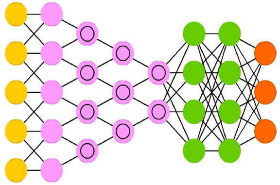

# Project Name
> Neural Networks with Keras and Tensorflow 

## Table of contents
* [General info](#general-info)
* [Screenshots](#screenshots)
* [Technologies](#technologies)
* [Setup](#setup)
* [Features](#features)
* [Status](#status)
* [Inspiration](#inspiration)
* [Contact](#contact)

## General info
The objective of this project is to learn how to build and appropriately use
Neural Networks (Deep Learning). For this purpose the Keras library with
Tensorflow as backend will be used.

## Screenshots

## Technologies
* Tech 1 - Plain _Python_
* Tech 2 - _Keras_
* Tech 3 - _Numpy_
* Tech 4 - _Tensorflow_

## Setup
Keep the scripts, files and modules in the same folder.

## Code Examples
Show examples of usage:
`import tensorflow as tf`

## Features
List of features ready and TODOs for future development
* Awesome feature 1
* Awesome feature 2
* Awesome feature 3

To-do list:
* Wow improvement to be done 1
* Wow improvement to be done 2

## Status
Project is: _in progress_, _finished_, _no longer continue_ and why?

## Inspiration
Add here credits. Project inspired by..., based on...

## Contact
Created by [@flynerdpl](https://www.flynerd.pl/) - feel free to contact me!
